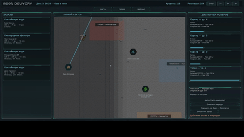
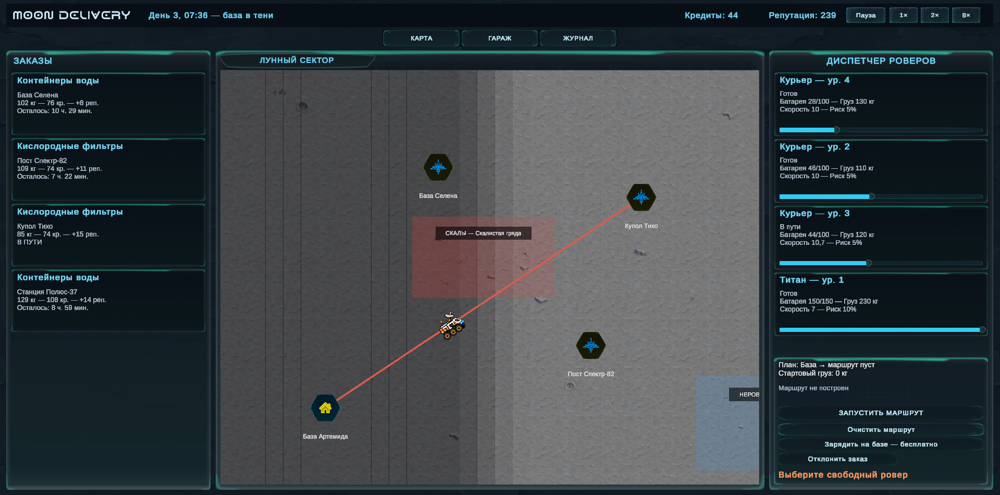
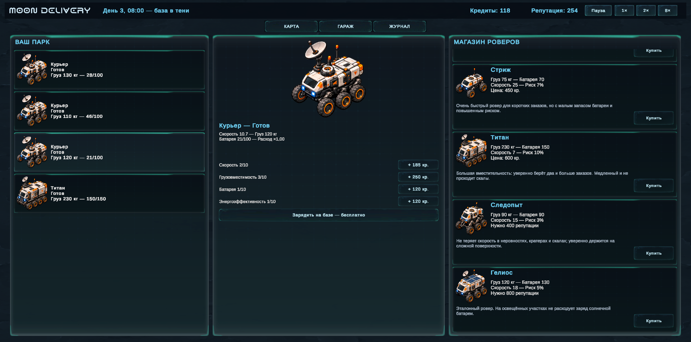

# Moon Delivery

Moon Delivery — небольшой симулятор лунной логистики. Игрок управляет компанией доставки: принимает заказы, выбирает подходящие роверы, прокладывает маршруты и старается не потерять деньги и репутацию.

  

## Играть в браузере

https://thedropedawp.github.io/MoonDelivery/

## Что сделано

- Большая карта Луны с перемещением камеры и масштабированием.
- Заказы с весом, наградой, репутацией и ограничением по времени.
- Маршруты из нескольких заказов и платных зарядных станций.
- Пять типов роверов с разными характеристиками и назначением.
- Равнины, неровности, кратеры и скалы, влияющие на скорость, расход энергии и риск.
- Цикл освещения, от которого зависит работа солнечного ровера.
- Гараж с покупкой, зарядкой, ремонтом и улучшением отдельных характеристик.
- Поломки, эвакуатор и возможность передать груз другому роверу.
- Журнал событий, экономика, репутация и постепенное усложнение заказов.
- Сохранение прогресса в редакторе, обычной сборке и WebGL.

## Скриншоты

| Карта и маршруты | Гараж и улучшения |
| --- | --- |
|  |  |

## Правила игры

Заказ нужно доставить до окончания указанного времени. Сначала игрок выбирает заказ и свободный ровер, затем собирает маршрут прямо на карте. В один рейс можно взять несколько заказов, если хватает грузоподъёмности и батареи. По пути разрешено добавлять зарядные станции.

За успешную доставку начисляются кредиты и репутация. Награда считается по формуле: базовые 30 кредитов, половина расстояния от базы до точки назначения и 30% от веса груза. Если отказаться от заказа, компания потеряет 100% его репутации. Просроченный заказ отнимает всю обещанную репутацию. При падении репутации ниже `-100` игра заканчивается.

Новые заказы появляются постепенно. В начале они легче и подходят стартовым роверам, а затем становятся тяжелее и разнообразнее.

## Как работает доставка

### Вес и батарея

Перед отправкой проверяется суммарный вес всех заказов. Перегруженный ровер не сможет выехать. Вес также снижает скорость, увеличивает расход энергии и немного повышает вероятность поломки.

Энергия рассчитывается для всего маршрута с учётом расстояния и поверхности. Неровности, кратеры и скалы требуют больше заряда. Зарядка на домашней базе бесплатная, но занимает время. Зарядные станции на карте работают быстрее и берут плату за фактически недостающий заряд.

### Риск

Для каждого участка учитываются базовая надёжность ровера, тип поверхности и текущая загрузка. Перед выездом игра находит самый опасный участок и делает один бросок риска на весь маршрут. Если он сработал, поломка произойдёт именно на этом участке. Поэтому длинный маршрут не создаёт десятки независимых проверок и не завышает вероятность аварии.

В случае поломки можно вызвать платный эвакуатор или отправить другой ровер, который заберёт груз и продолжит оставшуюся часть маршрута.

### Типы роверов

| Ровер | Груз | Батарея | Скорость | Риск | Особенность |
| --- | ---: | ---: | ---: | ---: | --- |
| Курьер | 100 кг | 100 | 10 | 5% | Универсальный стартовый ровер |
| Стриж | 75 кг | 70 | 25 | 7% | Очень быстрый, но рассчитан на короткие рейсы |
| Титан | 230 кг | 150 | 7 | 10% | Перевозит несколько заказов, но не проходит через скалы |
| Следопыт | 90 кг | 90 | 15 | 3% | Не теряет скорость на сложной поверхности и реже ломается там |
| Гелиос | 120 кг | 130 | 18 | 5% | Не расходует заряд на освещённых участках |

Новые модели открываются репутацией, после чего их всё равно нужно купить. Скорость, грузоподъёмность, батарею и энергоэффективность каждого ровера можно улучшать отдельно до десятого уровня.

## Управление

- `WASD` — перемещение камеры по карте.
- Зажатая правая кнопка мыши — перетаскивание карты.
- Колесо мыши — изменение масштаба.
- Левая кнопка мыши — выбор заказов и точек маршрута.
- Правая кнопка мыши по выбранной точке — удалить её из маршрута.
- `Esc` — открыть или закрыть меню паузы.
- Кнопки `1x`, `2x` и `8x` — изменить скорость игрового времени.

## Как запустить в Unity Editor

1. Установить Unity `6000.0.81f1`.
2. Клонировать репозиторий и открыть его корневую папку через Unity Hub.
3. Открыть сцену `Assets/Scenes/SampleScene.unity`.
4. Запустить.

## Хранение данных

Состояние игры хранится в структурированном виде в `GameState`. В него входят роверы, заказы, доставки, спасательные миссии, динамические точки карты, события журнала, деньги, репутация и игровое время.

При сохранении состояние сериализуется в `moon_delivery_save.json` внутри `Application.persistentDataPath`. В WebGL тот же файл синхронизируется с IndexedDB браузера через небольшой JavaScript-мост. Настройки громкости хранятся отдельно в `PlayerPrefs` и также сохраняются в браузере.

Основные параметры баланса и постоянные точки карты находятся в `Assets/MoonDelivery/Core/GameCatalog.cs`. Игровая логика разделена на сервисы заказов, маршрутов, флота, доставок, эвакуации и передачи груза.

## Использованные технологии

- Unity 6 и C#.
- Universal Render Pipeline.
- Unity UI и TextMeshPro.
- WebGL и IndexedDB для браузерной версии.

## Использование AI-инструментов

- Codex использовался для отладки, поиска и исправления ошибок, а также при написании части игровых механик.
- ChatGPT использовался для генерации спрайтов роверов и иконок, а также для правок игрового баланса.
- Suno AI использовался для создания фоновой ambient-музыки.

Все механики, визуальные материалы и результаты генерации проверялись и дорабатывались вручную в рамках проекта.
